# 🤖 PR Reviewer Skill

The `pr-reviewer` is an advanced, autonomous agentic skill designed for GitHub Copilot CLI. It acts as a Senior Code Reviewer, performing deep, independent audits of Azure DevOps Pull Requests by combining business logic from Work Items with actual code changes.

## 🌟 Architecture & Design

This skill is built upon a **"Split-Brain" (Hybrid) Architecture**, leveraging two distinct sources of truth to perform professional-grade reviews:

### 1. The Management Brain: Azure DevOps MCP
To understand the *intent* and *business rules* of a PR, the agent connects to Azure DevOps via the `azure-devops` Model Context Protocol (MCP) server. 
**Key MCP Tools Used:**
- `repo_get_pull_request_by_id`: Retrieves basic PR metadata (Status, Target/Source branches).
- `wit_get_work_item`: Extracts the linked User Story's `System.Description` and Acceptance Criteria to synthesize the **Functional Mission**.
- `repo_list_pull_request_threads`: Reads human discussions to correlate the agent's independent findings with ongoing team conversations.

### 2. The Code Brain: Isolated Local Git Strategy
To understand the *actual changes*, the agent does **NOT** rely on the MCP's search tools (which can't read unmerged feature branches). Instead, it acts autonomously:
- It uses your system's temporary directory (`%TEMP%` on Windows, `/tmp` on Unix).
- It creates a fast, isolated clone of the repository (`git clone --bare`).
- It generates a precise `git diff` to analyze exact code additions and deletions.
- It completely destroys the temporary folder after the review is done, ensuring zero footprint on the reviewer's machine.

---

## 🚀 How It Works (The Workflow)

When a developer invokes the skill (e.g., `/pr-reviewer 85129 project: copa-ebusiness-solutions-src repo: documents`), the agent executes the following autonomous sequence:

```mermaid
sequenceDiagram
    autonumber
    actor User
    participant Copilot as Copilot CLI (pr-reviewer)
    participant MCP as Azure DevOps MCP
    participant LocalOS as OS Terminal (Git / Temp)

    User->>Copilot: Invoke /pr-reviewer <PR_ID>
    
    rect rgb(20, 30, 45)
    Note over Copilot, MCP: Phase 1: Context & Business Rules
    Copilot->>MCP: Call repo_get_pull_request_by_id
    MCP-->>Copilot: PR Metadata & branch names
    Copilot->>MCP: Call wit_get_work_item (using linked WI ID)
    MCP-->>Copilot: Full Description & Acceptance Criteria
    Copilot->>Copilot: 🧠 Synthesize "Functional Mission"
    end
    
    rect rgb(30, 41, 59)
    Note over Copilot, LocalOS: Phase 2: Independent Code Audit
    Copilot->>LocalOS: Check current directory repository
    alt Not in target repository
        Copilot->>LocalOS: Create isolated clone in %TEMP%
    end
    Copilot->>LocalOS: git fetch source & target branches
    Copilot->>LocalOS: Run `git diff`
    LocalOS-->>Copilot: Raw Delta content (+ additions, - deletions)
    Copilot->>Copilot: 🔍 Analyze diff strictly against Functional Mission
    end

    rect rgb(20, 30, 45)
    Note over Copilot, MCP: Phase 3: Team Correlation
    Copilot->>MCP: Call repo_list_pull_request_threads
    MCP-->>Copilot: Human comments and feedback
    Copilot->>Copilot: Correlate Agent Findings with Human Discussions
    end
    
    Copilot->>LocalOS: Delete Temp isolated clone (Clean up)
    
    Copilot-->>User: Render Comprehensive PRO Report
```

## 📋 The "PRO" Output Standard

The agent produces a structured, emoji-free, English-only report divided into critical sections:

1. **Functional Mission**: A synthesized summary of what the code is *supposed* to achieve.
2. **Functional Alignment**: A strict Table mapping Acceptance Criteria and implicit requirements against concrete code evidence (`file:line`).
3. **Agent Findings & Code Proposals (Independent Audit)**: Pure AI-driven insights (bugs, performance risks, architectural suggestions), discovered *before* reading human comments. Includes actionable code block proposals.
4. **Team Discussion Review (Azure Threads Correlation)**: Evaluates if the team's ongoing discussions address the agent's findings, or if humans missed something the AI caught.
5. **Critical Observations & Summary**: Final verdict and action items.

## 🛠️ Requirements
- GitHub Copilot CLI authenticated and running.
- `azure-devops` MCP server configured and connected.
- Local `git` installation available in the system PATH.
