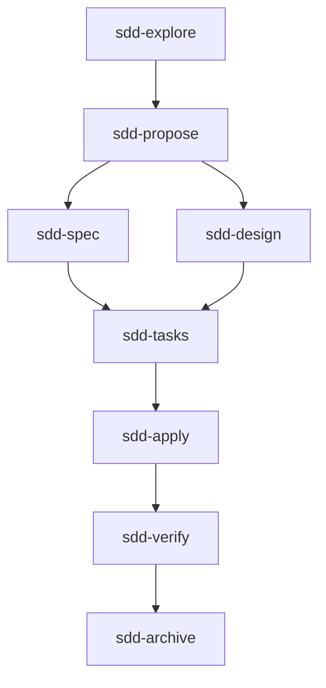
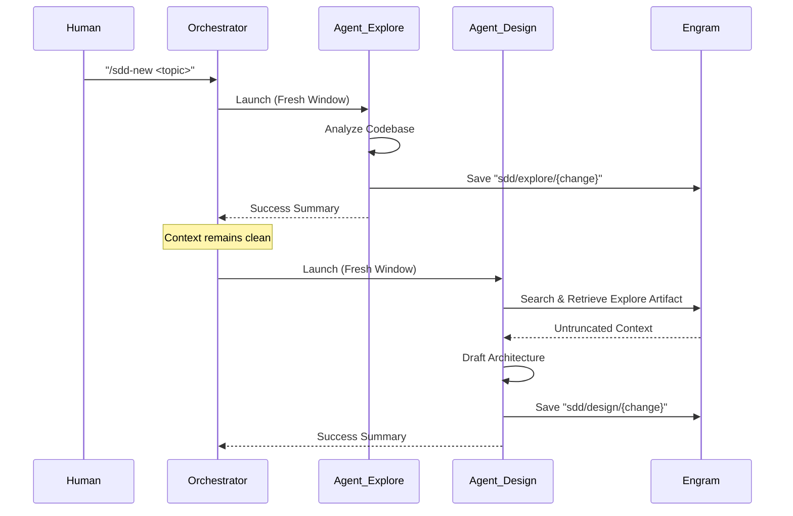

# Architecture & Sub-Agents 🏛️

The SDD Framework is built on the principle of **Modular Intelligence**. It addresses the fundamental limitations of modern LLMs—specifically the "Monolithic Agent" problem.

## 🚀 Why SDD? (The Context Window Advantage)

In a traditional AI interaction, a single agent is asked to do everything: explore the code, analyze logs, create a plan, and implement the fix. 

### The Monolithic Agent Problem ❌
- **Context Bloat**: As the agent reads files and generates plans, its context window fills up rapidly. 
- **Degradation**: Once the context is crowded, the agent loses focus, forgets earlier constraints, and starts hallucinating or producing shallow code.
- **High Token Cost**: Every turn involves re-sending a massive, cluttered context.

### The SDD Solution: Divide & Conquer ✅
SDD solves this by splitting the workload among specialized entities:
1.  **The Orchestrator**: A lightweight agent that acts as an "Air Traffic Controller". Its context window stays clean because it **never reads code** or executes tasks directly. It only routes metadata and manages the high-level workflow.
2.  **Specialized Sub-Agents**: When a task is needed (e.g., `sdd-explore`), a sub-agent is launched with a **fresh, independent context window**. It focuses 100% on its specific mission, executes it with high reasoning density, and then shuts down.
3.  **Extensible Skills**: The framework is easily extended with specialized capabilities. Developers can create [Custom Skills](skills-guide.md) to handle specific technical tasks or team standards.

## 🏛️ The SDD Lifecycle

SDD (Spec-Driven Development) is an evolution of TDD. It moves the "source of truth" from the code (or even the tests) to the **Technical Specification**. 

### The Lifecycle DAG

## 🧠 Persistence: The Knowledge Bridge (Engram)

A common challenge in multi-agent systems is: *"How does Sub-Agent 5 know what Sub-Agent 2 discovered?"*

Without a shared brain, you would have to pass all findings from agent to agent, bloating the context window again. SDD uses **Engram** as a dedicated persistence layer:

- **Programmatic Sharing**: Sub-agents save their findings to Engram via MCP tools (`mem_save`).
- **Standardized Discovery**: Any subsequent sub-agent can retrieve exactly what it needs (`mem_search`) without the Orchestrator needing to act as a data courier.
- **Traceability**: Findings are indexed and searchable, creating a permanent audit trail.

## 🤖 The Agents (Detailed Breakdown)

| Agent | Core Responsibility | Key Action |
| :--- | :--- | :--- |
| **`sdd-init`** | **Context Seeding** | Scans the repo to identify tech stack, standards, and patterns. Saves this "Project Manifesto" to Engram. |
| **`sdd-explore`** | **Deep Tracing** | Investigates the "Impact Path" of a change across all layers (API, Domain, Infra) to avoid shallow fixes. |
| **`sdd-propose`** | **Strategic Intent** | Synthesizes exploration into a formal proposal with scope, approach, and a Traceability Matrix. |
| **`sdd-spec`** | **Functional Definition** | Translates requirements into Gherkin-style scenarios (Given/When/Then). This is the source of truth for success. |
| **`sdd-design`** | **Technical Blueprint** | Maps file changes, data structures, and architectural decisions. It defines *how* the spec will be built. |
| **`sdd-tasks`** | **Implementation Planning** | Breaks the design into a granular, step-by-step checklist to ensure a logical execution sequence. |
| **`sdd-apply`** | **Autonomous Execution** | The implementer. Processes the task list, writes the actual code, and creates unit tests. |
| **`sdd-verify`** | **Quality Gate** | Acts as a Senior Reviewer. Performs static analysis against the Spec Matrix to ensure 100% compliance. |

---
[← Installation](installation.md) | [Home](../README.md) | [User Workflow →](workflow.md)
