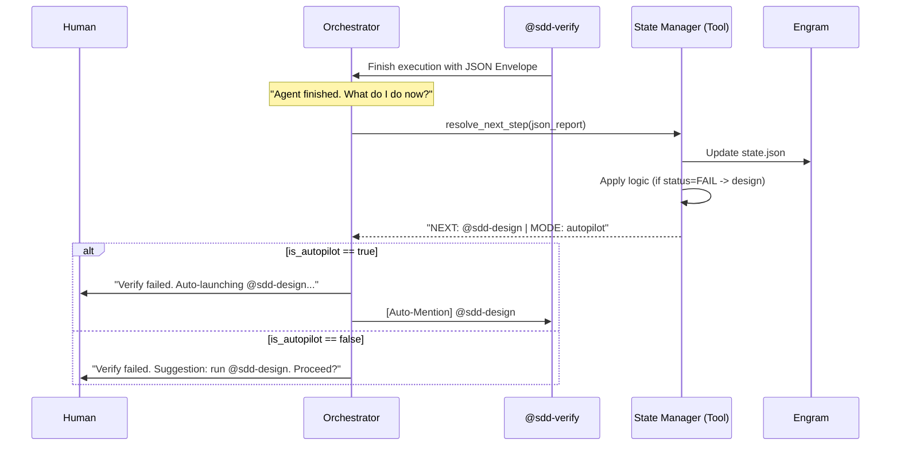

# SDD State Machine & Autopilot Protocol

This document defines the transition logic for the SDD Framework, enabling autonomous execution and deterministic error recovery.

## 🔄 State Transition Matrix

The framework follows a Directed Acyclic Graph (DAG) for success, but a state machine for recovery.

| Current Phase | Output Status | Target Phase | Reason |
| :--- | :--- | :--- | :--- |
| **`explore`** | SUCCESS | `propose` | Exploration complete. |
| **`propose`** | SUCCESS | `spec` & `design` | Proposal approved. |
| **`spec` / `design`** | SUCCESS | `tasks` | Requirements & blueprints ready. |
| **`tasks`** | SUCCESS | `apply` | Plan is actionable. |
| **`apply`** | SUCCESS | `verify` | Implementation finished. |
| **`verify`** | **FAIL (Lints/Static)** | **`apply`** | Bugs found in coding/standards. |
| **`verify`** | **FAIL (Logic/Spec)** | **`spec`** | The code doesn't meet the functional requirement. |
| **`verify`** | **FAIL (Architecture)** | **`design`** | Implementation violates design patterns. |
| **`apply`** | **FAIL (Blocked)** | **`design`** | Implementation revealed architectural flaw. |
| **`any`** | CRITICAL FAIL | **`explore`** | Fundamental misunderstanding of code. |

## 🕹️ Hybrid Execution Models

The framework supports two modes of execution, configurable per project or per session.

### 1. Manual Mode (Default)
- **Flow**: Sub-agent $\rightarrow$ Orchestrator $\rightarrow$ **Human Pause** $\rightarrow$ Next Phase.
- **Use Case**: Critical changes, complex refactors, or when the team is first adopting SDD.
- **Benefit**: 100% oversight and visibility.

### 2. Autopilot Mode
- **Flow**: Sub-agent $\rightarrow$ Orchestrator $\rightarrow$ **State Manager Decide** $\rightarrow$ Auto-Next Phase.
- **Use Case**: Repetitive changes, well-understood tasks, or when the team has high confidence in the agent's prompts.
- **Benefit**: Minimum developer intervention; maximum speed.

## ⚙️ Configuration (`sdd/config/{project}`)

| Key | Type | Description |
| :--- | :--- | :--- |
| `mode` | `manual` \| `autopilot` | Global execution mode for the project. |
| `auto_apply` | `boolean` | If true, auto-starts `sdd-apply` after tasks are generated. |
| `max_retries` | `number` | Max loops between `verify` and `apply` before stopping. |

## 🧠 Deterministic Orchestration (The State Manager)

Rather than full LangGraph (which requires an external runtime), we implement a **State Manager Skill** in Python, managed by our MCP installer.

### Data Schema (Engram: `sdd/state/{change}`)
```json
{
  "change_name": "...",
  "current_phase": "verify",
  "status": "FAIL",
  "attempts": {
    "apply": 2,
    "verify": 1
  },
  "last_error": "Unit tests failed: test_auth_token",
  "history": [
    {"phase": "propose", "result": "SUCCESS"},
    {"phase": "apply", "result": "SUCCESS"},
    {"phase": "verify", "result": "FAIL", "loopback": "apply"}
  ]
}
```

### The Transition Table (Logic)
The Manager implements this conditional logic:
1. `IF status == SUCCESS -> next_phase = DAG.next(current_phase)`
2. `IF status == FAIL -> next_phase = LoopbackMatrix[current_phase][error_type]`
3. `IF attempts[current_phase] > 3 -> next_phase = BLOCKED_ON_HUMAN`

## 🤖 How the State Manager Works

The State Manager is **NOT** an agent; it is a **TOOL** (MCP Skill) that the Orchestrator calls to make decisions.

### Sequence Diagram: The "Hand-off"



### Why a Skill and not just Prompt Logic?
1. **Determinismo**: El código Python no "alucina". Si la regla dice que tras un fallo de arquitectura vas a `sdd-design`, el sistema SIEMPRE irá ahí.
2. **Context Savings**: El orquestador no tiene que recordar qué pasó hace 3 fases. Solo le pregunta a la herramienta, y la herramienta consulta la base de datos (Engram).
3. **Mantenibilidad**: Es más fácil cambiar una línea de Python en la Skill que intentar "convencer" a un modelo de lenguaje de seguir un grafo complejo mediante un prompt de 1000 líneas.
