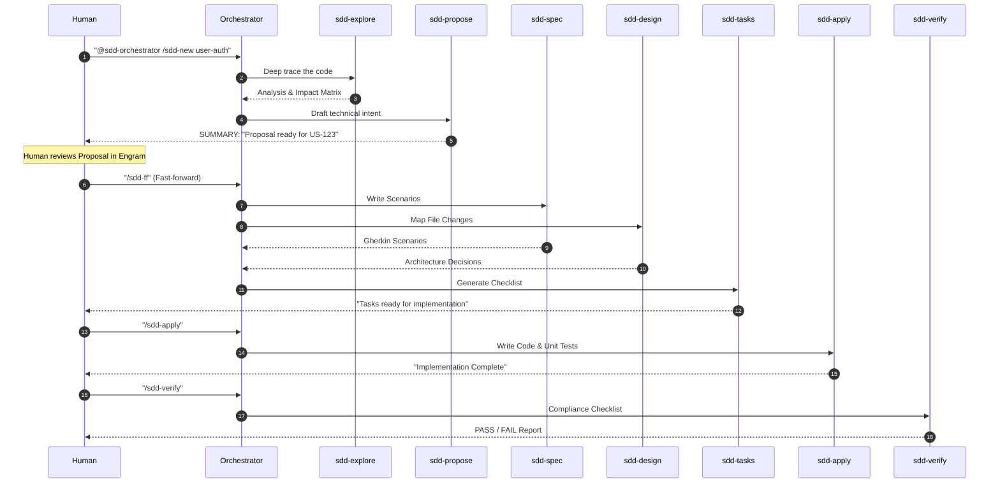

# SDD Workflow: From Idea to Verification 🚀

This guide explains how to practically navigate the SDD lifecycle using your favorite AI assistant.

## 👋 The Human-in-the-Loop Philosophy

In SDD, the AI is NOT a replacement for the engineer. It is a **force multiplier**.
- **Sub-Agent Echoes**: After generating an artifact, the sub-agent **immediately prints it in the chat** for you to see.
- **Human Authorizes**: You review the proposal, spec, or design directly in the chat window. 
- **Orchestrator Gatekeeps**: The orchestrator asks for your approval before launching the next phase.
- **Transparent Lifecycle**: No more "black boxes"—you see every piece of work the AI produces in real-time.

## 🛠️ Essential Commands

The **Orchestrator** is your main touchpoint. It understands these metadata-commands:

| Command | Action | Recommended Usage |
| :--- | :--- | :--- |
| **`/sdd-init`** | Scan repo and set project context. | Run once per project. |
| **`/sdd-new`** | Starts a new change. Launches `Explore` → `Propose`. | Use for any non-trivial change. |
| **`/sdd-ff`** | Fast-forwards from Proposal to `Tasks`. | Use when you agree with the intent. |
| **`/sdd-apply`** | Starts the autonomous implementation. | Use when tasks are clear and the spec is solid. |
| **`/sdd-verify`** | Runs the quality gate. | Run after every implementation phase. |

## 🔄 Lifecycle Interaction Flow

## 💡 Pro-Tips for Success

1.  **The User Story is Manifesto**: Always provide the User Story (Jira/Azure DevOps ticket) in the initial prompt or via Engram. Sub-agents are hard-coded to ignore anything that doesn't map to the US.
2.  **Executive Summaries**: Sub-agents return a "Return Envelope". Look at the **Status** (success/blocked) and **Next** (recommended phase) to know where you are.
3.  **State Recovery**: If your IDE crashes or you lose chat history, don't panic. Use `/sdd-show proposal` to recover the state from Engram.
4.  **Feedback Loops**: You can always stop the machine. If `sdd-propose` suggests something you dislike, just say: "Reject and re-propose using Strategy B".

---
[← Architecture](architecture.md) | [Home](../README.md)
